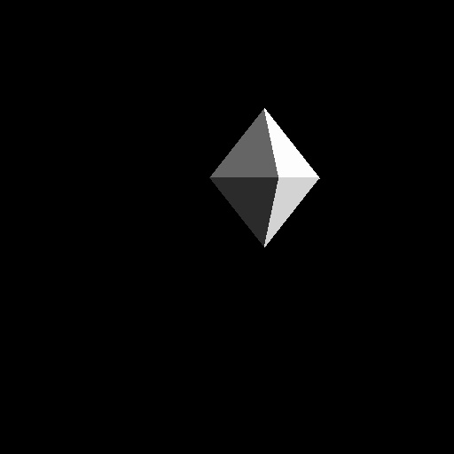

# Лабораторные работы по Компьютерной Графике

Список выполненых лабораторных работ:

* [Лабораторная работа 1](lab01/) - Алгоритм Брезенхема (линия, окружность, часы)
* [Лабораторная работа 2](lab02/) - Алгоритм Кируса-Бека для построения отрезка
* [Лабораторная работа 3](lab03/) - Фильтр Собеля
* [Лабораторная работа 4](lab04/) - Построение кривых Безье второго порядка
* [Лабораторная работа 5](lab05/) - Заполнение многоугольника
* [Лабораторная работа 6](lab06/) - Поворот кривой Безье матрицей поворота
* [Лабораторная работа 7](lab07/) - Построение 3d фигуры (diamond) с освещением

## Лабораторная работа 1
Алгоритм Брезенхема для линии, окружности и часов
Результат работы программы

## Лабораторная работа 2
Алгоритм Кируса-Бека для построения отрезка
Результат работы программы

## Лабораторная работа 3
Алгоритм обработки картинок Фильтр Собеля
Исходная картинка

Обработанная картинка

## Лабораторная работа 4
Алгоритм построения кривых Безье второго порядка

## Лабораторная работа 5
Алгоритм заливки многоугольника

## Лабораторная работа 6
Алгоритм поворота кривой Безье матрицей поворота

## Лабораторная работа 7
Алгоритм построения 3d фигуры Diamond с обработкой освещения

